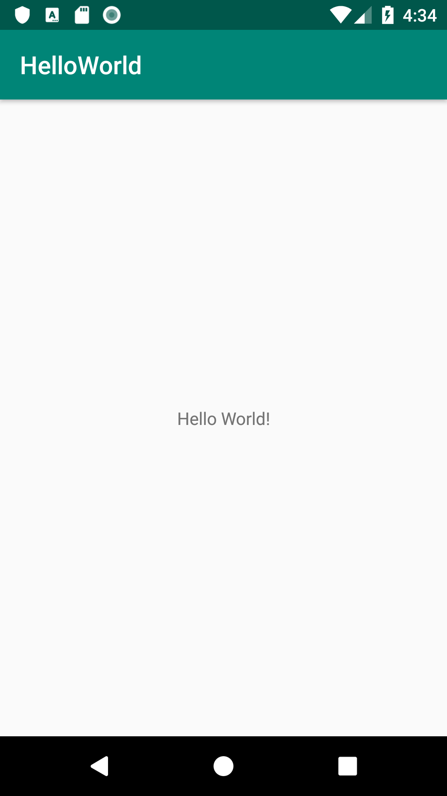
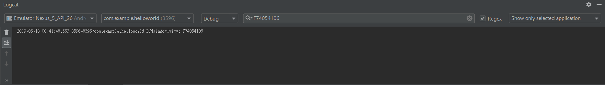

# AAD_1072_HW01

Please follow the instructions on the **Homework** sections in these codelabs.

- [01.1: Android Studio and Hello World](https://codelabs.developers.google.com/codelabs/android-training-hello-world/index.html#12)
- [01.2 Part B: The layout editor](https://codelabs.developers.google.com/codelabs/android-training-layout-editor-part-b/#9)
- [01.3: Text and scrolling views](https://codelabs.developers.google.com/codelabs/android-training-text-and-scrolling-views/index.html?#10)
- [01.4: Learn to help yourself](https://codelabs.developers.google.com/codelabs/android-training-available-resources/index.html?#9)

## Part 1. Questions (20 pt)
Please submit your answer on moodle.
<https://moodle.ncku.edu.tw/course/view.php?id=104771>

**[Notice]** 
- You only have **one chance** to submit your answer.
- Your score on moodle (out of 100) * 20 % = your points in this part.  
For example, you score on moodle is 50, and then you got 50 * 20 % = 10 pt for this homework

| Codelab | Questions |
| --- | ----------- |
| 01.1 | 4 Questions |
| 01.2 Part B| 4 Questions |
| 01.3 | 3 Questions |
| 01.4 | 3 Questions |

## Part 2. ScreenShots (10 pt)

Please upload your screenshots in this repo **with specific file name in "screenshots" folder**.

| Codelab | Questions | Points |
| --- | ----------- | ---|
| 01.1 | An Activity that displays "Hello World" on the screen    | 3 pt |
| 01.1 | Log your **student ID** in **debug** level and screenshots the Logcat pane shows only your log    | 3 pt |
| 01.4: Step 4 | An app with a new launcher icon that appears in the Search Apps screen of an Android device.    | 4 pt |

## Part 3. Android Tests (70 pt)

Please submit your code to the **master** branch in this repository for grading.

**[Notice]** 
- Please do not modify the following files:
    - .travis.yml
    - <Project>/app/src/androidTest/*
    - gradle files
- Once any modifications or any cheating behavior are detected, you will got 0 pt for this homework.
- Creating a new branch to develop and testing locally are highly recommended.
    
<table>
    <thead>
        <tr>
            <th>Codelab</th>
            <th>Starter Code</th>
            <th>Questions</th>
            <th>Points</th>
        </tr>
    </thead>
    <tbody>
        <tr>
            <td rowspan=5>01.2 Part B</td>
            <td rowspan=5>HelloToast</td>
            <td>testZeroButtonDisplay</td>
            <td>10 pt</td>
        </tr>
        <tr>
            <td>testZeroButtonLocation</td>
            <td>10 pt</td>
        </tr>
        <tr>
            <td>testZeroButtonInLayoutVariants</td>
            <td>10 pt</td>
        </tr>
        <tr>
            <td>testZeroButtonFunction</td>
            <td>10 pt</td>
        </tr>
        <tr>
            <td>testCountButtonFunction</td>
            <td>10 pt</td>
        </tr>
        <tr>
            <td rowspan=2>01.3</td>
            <td rowspan=2>ScrollingText2</td>
            <td>testTextViewTwoColumn</td>
            <td>10 pt</td>
        </tr>
        <tr>
            <td>testLinearLayoutOrientation</td>
            <td>10 pt</td>
        </tr>
    </tbody>
</table>

----
## Optional Homework

Following quesetions are optional. 
**Please do not upload any results of these questions.**

| Codelab | Questions |
| --- | --- |
| 01.2 Part.B: Step 1 | Change the name of the project to HelloConstraint, and refactor the project to Hello Constraint. |
| 01.4: Step 1-3 | 1.Load one of the sample apps into Android Studio. 2. Open one of the Java activity files in the app. Look for a class, type, or procedure that you're not familiar with and look it up in the Android Developer documentation. 3.Go to Stack Overflow and search for questions on the same topic. |

----

## ScreenShots Examples
### submit unsucessfully

### submit sucessfully

