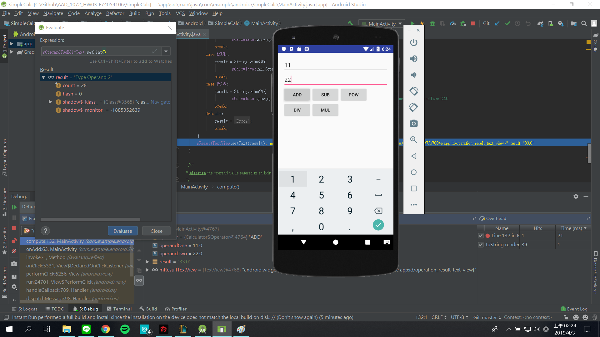

# AAD_1072_HW03

Please follow the instructions on the Homework sections in these codelabs.

- [03.1: The debugger](https://codelabs.developers.google.com/codelabs/android-training-using-debugger/index.html?#0)
- [03.2: Unit tests](https://codelabs.developers.google.com/codelabs/android-training-unit-tests/index.html?#0)
- [03.3: Support libraries](https://codelabs.developers.google.com/codelabs/android-training-support-libraries/index.html?#0)

## Part 1. Questions (35 pt)
Please submit your answer on moodle.
<https://moodle.ncku.edu.tw/course/view.php?id=104771>

**[Notice]** 
- You only have **one chance** to submit your answer.
- Your score on moodle (out of 100) * 35 % = your points in this part.  
For example, you score on moodle is 50, and then you got 50 * 35 % = 17.5 pt for this homework

| Codelab | Questions |
| --- | ----------- |
| 03.1 | 3 Questions |
| 03.2 | 3 Questions |
| 03.3 | 3 Questions |

## Part 2. ScreenShots (20 pt)

Please upload your screenshots in this repo **with specific file name in "screenshots" folder**.
Make sure your screenshots including the following components.

1. **Emulator**
2. **Debug pane**
3. **Code and line numbers**

| Codelab | Questions | Points |
| --- | ----------- | ---|
| 03.1 | Create a breakpoint at **mResultTextView.setText(result)** in **compute()** method.    | 5 pt |
| 03.1 | Add condition **(operandOne == 11)&&(operandTwo == 22)** to the breakpoint created at step 1.    | 5 pt |
| 03.1 | Run the app in debug mode and do something to halt the execution at the conditional breakpoint.    | 5 pt |
| 03.1 | Call **getHint()** of **mOperandTwoEditText** in evaluate code fragment window.   (Please include evaluate code fragment window in your screenshot for this question)    | 5 pt |

## Part 3. Android Tests (45 pt)

Please submit your code to the **master** branch in this repository for grading.

**[Notice]** 
- Please do not modify the following files:
    - .travis.yml
    - <Project>/app/src/androidTest/*
    - gradle files
- Once any modifications or any cheating behavior are detected, you will got 0 pt for this homework.
- Creating a new branch to develop and testing locally are highly recommended.

### Android Tests

| Codelab | Questions | Points |
| --- | ----------- | ---|
| 03.2 | It displays a **POW** Button that provides an exponential ("power of") calculation. | 5 pt |
| 03.2 | The implementation of MainActivity includes a click handler for the **POW** Button. | 5 pt |

### Unit Tests

Please comment the **fail()** statement of each test in **CalculatorTest** class and implement the corresponding test.

| Codelab | Questions | Points |
| --- | ----------- | ---|
| 03.2 | A test with positive integer operands. | 5 pt |
| 03.2 | A test with a negative integer as the first operand. | 5 pt |
| 03.2 | A test with a negative integer as the second operand. | 5 pt |
| 03.2 | A test with 0 as the first operand and a positive integer as the second operand. | 5 pt |
| 03.2 | A test with 0 as the second operand. | 5 pt |
| 03.2 | A test with 0 as the first operand and -1 as the second operand. (Hint: consult the documentation for Double.POSITIVE_INFINITY.) | 5 pt |
| 03.2 | A test with -0 as the first operand and any negative number as the second operand. | 5 pt |

## ScreenShots Examples
### submit unsucessfully

### submit sucessfully

