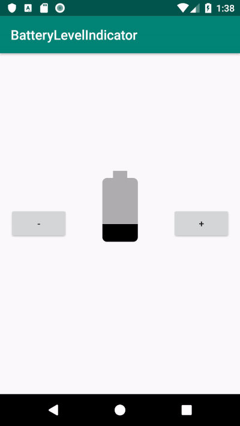

# AAD_1072_HW05

Please follow the instructions on the **Homework** sections in these codelabs.

- [05.1: Drawables, styles, and themes](https://codelabs.developers.google.com/codelabs/android-training-drawables-styles-and-themes/index.html?index=..%2F..%2Fandroid-training#11)
- [05.2: Cards and colors](https://codelabs.developers.google.com/codelabs/android-training-cards-and-colors/index.html?index=..%2F..%2Fandroid-training#11)
- [05.3: Adaptive layouts](https://codelabs.developers.google.com/codelabs/android-training-adaptive-layouts/index.html?index=..%2F..%2Fandroid-training#10)

## Part 1. Questions (20 pt)
Please submit your answer on moodle.
<https://moodle.ncku.edu.tw/course/view.php?id=104771>

**[Notice]** 
- You only have **one chance** to submit your answer.
- Your score on moodle (out of 100) * 20 % = your points in this part.  
For example, you score on moodle is 50, and then you got 50 * 20 % = 10 pt for this homework

| Codelab | Questions |
| --- | ----------- |
| 05.1 | 3 Questions |
| 05.2 | 3 Questions |
| 05.3 | 3 Questions |

## Part 2. Android Tests (40 pt)

Please submit your code to the **master** branch in this repository for grading.

**[Notice]** 
- Please do not modify the following files:
    - .travis.yml
    - <Project>/app/src/androidTest/*
    - gradle files
- Once any modifications or any cheating behavior are detected, you will got 0 pt for this homework.
- Creating a new branch to develop and testing locally are highly recommended.
    
<table>
    <thead>
        <tr>
            <th>Codelab</th>
            <th>Starter Code</th>
            <th>Questions</th>
            <th>Points</th>
        </tr>
    </thead>
    <tbody>
        <tr>
            <td>05.1</td>
            <td>BatteryLevelIndicator</td>
            <td>viewTest</td>
            <td>20 pt</td>
        </tr>
        <tr>
            <td>05.3</td>
            <td>RecyclerView</td>
            <td>GridLayoutManagerTest</td>
            <td>20 pt</td>
        </tr>
    </tbody>
</table>

## Part 3. ScreenShots (40 pt)

Please upload your screenshots in this repo **with specific file name in "screenshots" folder**.
Make sure your screenshots including the following components.

- [免費線上影片轉 GIF 動圖](https://www.kocpc.com.tw/archives/225214)

| Codelab | Questions | Points |
| --- | ----------- | ---|
| 05.1 |  Tapping the plus(three times) and minus button(two times) changes the level of the indicator.    | 20 pt |
| 05.2 |  The **banner image** from the card moves to the top of the screen in the detail view.    | 20 pt |
